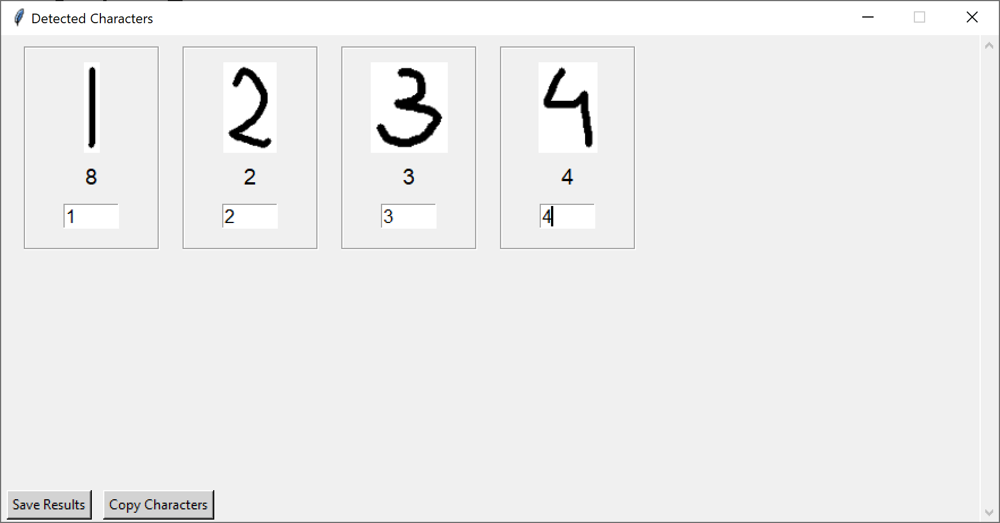

# Hand Drawing Canvas

This project implements a character detection system using Python. It utilizes OpenCV, Mediapipe, PyTorch and Tkinter for image processing and model inference.

## Libraries Used

- **OpenCV**: For image processing and handling canvas interactions
- **Mediapipe**: For real-time detection of hand landmarks and gestures
- **PyTorch**: For character recognition and machine learning model inference
- **Tkinter**: For GUI

## Demonstration




## Installation

1. Install [Python 3.10.0](https://www.python.org/downloads/release/python-3100/). Ensure that the "**Add python.exe to PATH**" option is selected during installation. 
2. Open terminal in a project directory and run following commands:
```bash
    python -m venv .venv
    .venv\Scripts\activate
    pip install -r requirements.txt
```

## Usage

To start program run a following command inside a project directory:
```bash
    python main.py 
```

## Gestures

Hand Drawing Canvas recognizes the following hand gestures:

- **Writing Gesture**:  
  This gesture is recognized when:
  - The horizontal positions of **landmarks 3** and **4** are in one order, and **landmarks 5** and **17** are in another order (i.e., either **landmark 5** is to the left of **landmark 17** or **landmark 17** is to the left of **landmark 5**).
  - The vertical position of **landmark 8** is above **landmark 7**.

- **Erasing Gesture**:  
  This gesture is identified when the following conditions are met:
  - The vertical position of **landmark 8** is above **landmark 7**.
  - The vertical positions of **landmark 12** and **landmark 11** are below their respective landmarks.
  - The vertical positions of **landmark 16** and **landmark 15** are below their respective landmarks.
  - The vertical positions of **landmark 20** and **landmark 19** are below their respective landmarks.

The gestures are detected in real-time, with visual feedback provided on the screen via circles drawn at the key landmarks, along with labels indicating the detected gesture.  

  

## Manualy Config Data

### Datasets
Download any dataset at: [kaggle.com/dataset](https://www.kaggle.com/datasets)  
Organize your dataset by creating a folder for each character and placing the corresponding images inside. For more details on dataset structure, refer to "**dataset**" > "**readme.md**".

### Training
To train model run:
```bash
    python train.py
```

### Video stream with hand recognition
To try hand recognition through video streaming run:
```bash
    python video_stream.py
```

## Support

Star this repository :star:  
Follow me on [Github](https://github.com/ikbalcaus) and [Linkedin](https://www.linkedin.com/in/ikbalcaus/)  
Share this project with other people
